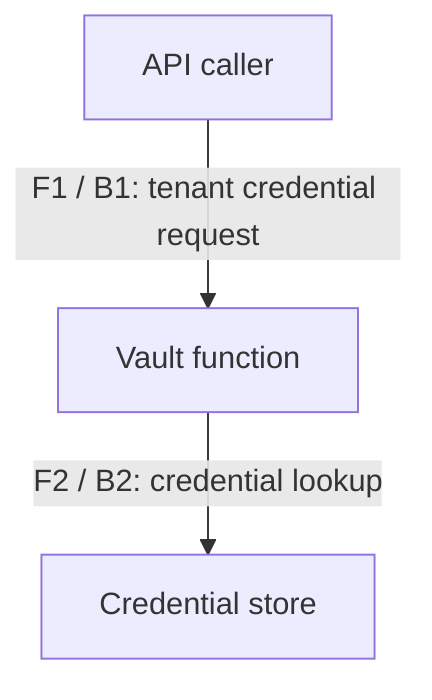

# Synthetic vault threat model

This is a teaching example, not a real product assessment. No human approval has been obtained.
Source revision: synthetic-rev-1. Inventory is provisional. Status: pending_review.

## scope
Assess only readCredential in examples/toy-pam/vault.mjs. Protect tenant credentials against
unauthorized reads. The upstream API, deployment, encryption and operational controls are unknown.

## architecture
Actor A1 is an authenticated API caller; process P1 is readCredential; store D1 contains credentials.
F1 crosses B1, the caller-to-vault boundary, carrying principal, tenantId and credentialId.
F2 crosses B2, the vault-to-store boundary. Scope is checked in P1; tenant binding is not visible.

## threats
T-vault-001 is an inferred isolation threat: the function accepts caller-supplied tenantId and
checks only a global scope. Exploitability depends on upstream binding that is not supplied.
STRIDE I/E apply. Spoofing depends on upstream principal validation; tampering and repudiation
need store/audit evidence; denial of service needs workload and rate-limit context. These are
explicit gaps for a broader assessment, not claims that the categories are safe or inapplicable.

## controls
The code contains a vault:read check. Its end-to-end effectiveness is unverified. No test executed.

## risk
High inherent impact; residual risk unknown pending upstream evidence. Example owner: vault team.
Investigate binding and enforce tenant-scoped authorization. No risk acceptance recorded.

## verification
Plan an isolated negative test: a normal tenant A principal requests tenant B's secret. It must be
denied before store access, with a redacted audit event. Also test legitimate same-tenant access.
This is a planned verification step, not a passing test result.

## cross_module
Potential path: upstream API accepts forged tenant context -> vault scope check -> foreign secret.
The API implementation is absent, so this is a hypothesis; request its routing and policy evidence.

## Review and freshness
No human review. Same synthetic revision. Request inventory completeness confirmation, upstream
policy evidence, control verification and source-bound review before making any real coverage claim.
